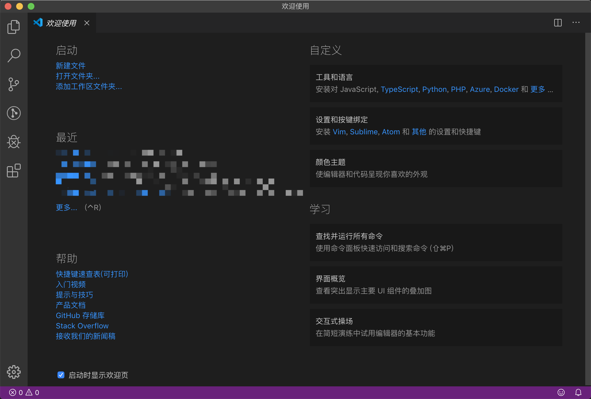
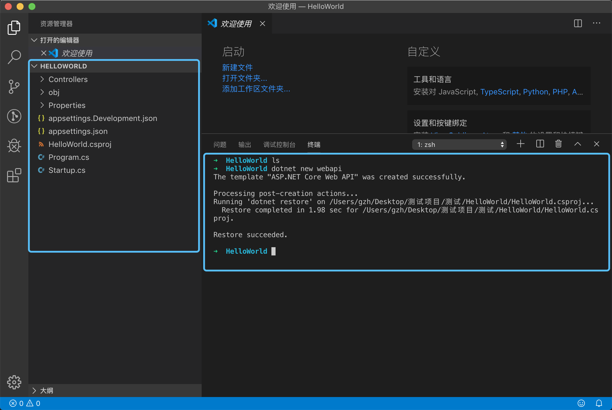
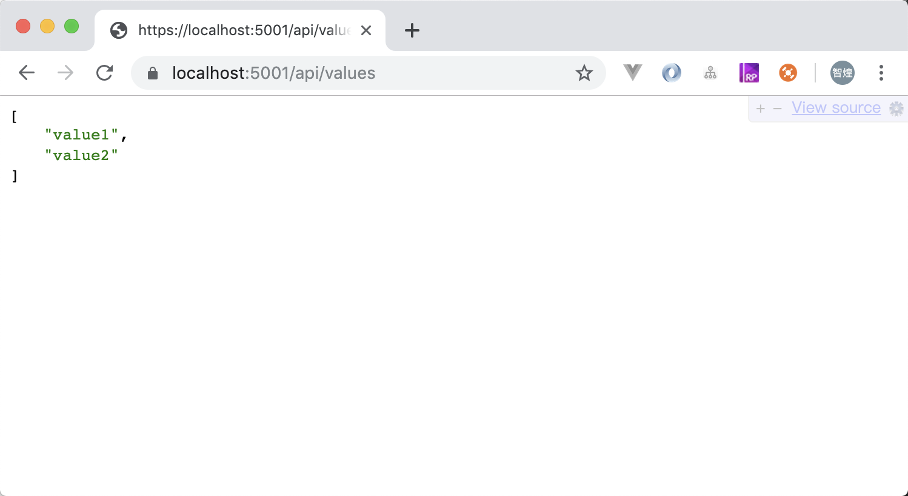

### 开发环境
* windows、mac、linux都可以,要安装对应系统的sdk
  sdk下载地址：https://dotnet.microsoft.com/download/dotnet-core/2.2

  检查是否安装成功：
  ```
  dotnet --help   # 查看dotnet命令有哪些参数
  dotnet --info
  dotnet --list-sdks  # 列出安装的所有版本的sdk

  ```
* 开发工具

可以使用 Visual Studio、Visual Studio Code、Sublime Text、Vim 等文本编辑器或集成开发环境 (IDE)

推荐vscode，可以跨平台，不同平台开发体验基本一样

vscode插件：C#

### vscode创建webapi项目

1. 在本机新建一个用于存放项目的文件夹如HelloWorld,



2. 打开vscode,点击打开文件夹，打开刚刚创建的HelloWorld目录打开终端（terminal）

3. 在终端输入 `dotnet new webapi`



4. 在终端输入 `dotnet run`


5. 打开浏览器，输入 `https://localhost:5001/api/values`



6. 一个webapi项目就跑起来了，详细可参考https://docs.microsoft.com/zh-cn/dotnet/core/tutorials/with-visual-studio-code